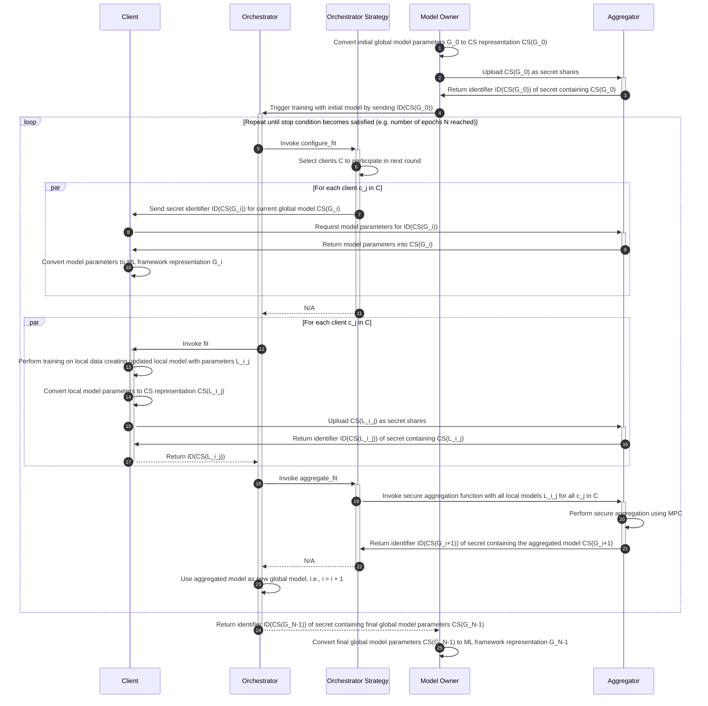
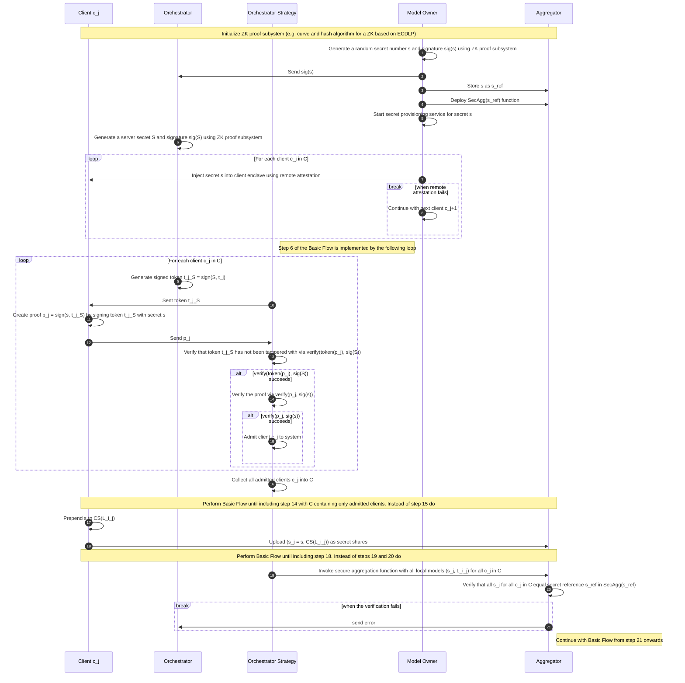

# CSEP-0055: Privacy-Preserving Federated Learning

<!-- markdownlint-disable MD051 -->

<!-- TOC -->

- [CSEP-0055: Privacy-Preserving Federated Learning](#csep-0055-privacy-preserving-federated-learning)
  - [Summary](#summary)
    - [Namesake](#namesake)
  - [Motivation](#motivation)
    - [Goals](#goals)
    - [Non-Goals](#non-goals)
  - [Proposal](#proposal)
    - [User Stories](#user-stories)
      - [Story 1](#story-1)
      - [Story 2](#story-2)
    - [Notes/Constraints/Caveats](#notesconstraintscaveats)
    - [Risks and Mitigations](#risks-and-mitigations)
  - [Design Details](#design-details)
    - [Roles](#roles)
    - [Security Model](#security-model)
    - [Data Privacy](#data-privacy)
    - [Aggregation Method](#aggregation-method)
    - [Weight Representation](#weight-representation)
    - [Flow](#flow)
      - [Basic Flow](#basic-flow)
      - [Flow with client-side model protection](#flow-with-client-side-model-protection)
    - [Open Questions](#open-questions)
      - [Data Conversion](#data-conversion)
    - [Missing pieces](#missing-pieces)
  - [Alternatives](#alternatives)
    - [No Global Model Obliviousness](#no-global-model-obliviousness)
  - [Infrastructure Needed](#infrastructure-needed)

<!-- TOC -->

<!-- markdownlint-enable MD051 -->

## Summary

Nettle is an integration layer between the [Flower] federated learning framework
and Carbyne Stack. Nettle allows for large-scale privacy-preserving federated
learning with MPC-based secure aggregation to protect against inference attacks.
In addition, Nettle uses confidential computing techniques to protect the model
on the clients.

### Namesake

A _nettle_ is a chiefly coarse herb armed with stinging hairs. Carbyne Stack
Nettle is a fortified version of Flower that can resist certain kinds of
attacks.

## Motivation

Federated Learning is taking up momentum in many domains. In addition, FL lends
itself very well to adding privacy via MPC as the required operations for secure
aggregation and model updates are comparatively lightweight. FL is also a major
technique used in the [CRYPTECS] PfP that adopted Carbyne Stack for executing
MPC workloads.

### Goals

- Provide a service that supports privacy-preserving FL by offloading model
  aggregation and update to a Carbyne Stack Virtual Cloud
- Integrate with a major federated learning framework to minimize implementation
  effort and maximize applicability

### Non-Goals

- Carbyne Stack Python clients
- MPC-based _centralized_ evaluation of the current model

## Proposal

This CSEP describes how a service that supports privacy-preserving FL by
offloading model aggregation to a Carbyne Stack Virtual Cloud can be implemented
by integrating Carbyne Stack with the FL framework [Flower]. The proposal covers
a basic scheme that protects data samples and the model from the central
orchestrator. Variations of the basic scheme are also presented: one with a
weaker security model that exposes the global model to the orchestrator and one
with a stronger one that protects the model on the clients as well by using
Confidential Computing techniques.

### User Stories

> **Note** Work in Progress

This is an _optional_ section.

#### Story 1

#### Story 2

### Notes/Constraints/Caveats

> **Note** Work in Progress

This is an _optional_ section.

### Risks and Mitigations

> **Note** Work in Progress

## Design Details

### Roles

- The **Model Owner** is the owner of the global model and the only party in the
  system with clear-text access to it (assuming
  [client-side model protection](#flow-with-client-side-model-protection) is
  implemented).

- **Clients** are participants in the FL system that hold local data samples
  that are not shared with other system participants.

- The **Orchestrator** drives the distributed FL process by triggering actions
  on the clients. Coordination includes selection of clients that participate in
  a training round, providing references to the initial and updated model used,
  and evaluating the progress made in a training round. The orchestrator
  delegates updating the model to the aggregator.

- The **Aggregator** receives the model updates from the clients, computes the
  aggregated model update, and updates the global model accordingly. By
  leveraging MPC, the aggregator is oblivious of the updates and the global
  model.

### Security Model

Attacks against FL systems fall into four major categories (see
[this paper][secfl]) for a good overview: poisoning attacks, inference attacks,
communication attacks, and free-riding attacks. The first iteration of Nettle as
described in this CSEP focuses primarily on inference attacks. These attacks try
to extract meaningful insights about the training data via analysis of the
locally derived model updates. Nettle prevents this kind of attacks by hiding
the locally computed model updates from the orchestrator by delegating the
aggregation of updates to an MPC-powered distributed aggregator.

A variation of the basic Nettle scheme also protects against unauthorized model
extraction by running client-side logic in Confidential Computing enclaves.

Future iterations may also address other attack classes.

### Data Privacy

The following table summarizes which party is aware of what data in the Nettle
system:

| Knows             | Client                                                         | Orchestrator | Aggregator |
| ----------------- | -------------------------------------------------------------- | ------------ | ---------- |
| **Data Samples**  | Yes                                                            | No           | No         |
| **Model Updates** | Yes / No (if using CC for client-side global model protection) | No           | No         |
| **Global Model**  | Yes / No (if using CC for client-side global model protection) | No           | No         |

### Aggregation Method

Nettle uses the simple aggregation method of [SAFELearn]. SAFELearn uses a
simple calculation of the sum of the model weight updates (local operation in
MPC) followed by a division by the number of sampled clients.

### Weight Representation

The model weights can either be represented by the MP-SPDZ `sfloat` or `sfix`
[data types][mp-spdz-data-types]. While the former results in larger overheads,
the latter leads to quantization errors and potentially degraded accuracy. For
reasons of simplicity this first iteration of Nettle uses weights represented as
`sfloat` values.

### Flow

#### Basic Flow

The basic Nettle FL flow is depicted in the following sequence diagram and
described in more detail below. The notation used in the diagram is as follows:

- `G_i` denotes the global model parameters in iteration \`i\`\`.
- The `CS(params)` denotes the representation of the model parameters `params`
  as required by MP-SPDZ / Carbyne Stack.
- `ID(s)` is the identifier of the secret `s` stored in the Amphora service.
- `L_i_j` denotes the locally generated model update in training round _i_ on
  client _j_.

In the following we reference methods of the Flower [NumPyClient][flower-client]
and [Strategy][flower-strategy] classes.

<!-- markdownlint-disable MD013 -->

<!-- markdownlint-enable MD013 -->

The following steps are performed by Nettle:

- The model owner uploads the initial global model parameters to Amphora (steps
  2-3). For that purpose the model is converted into an array of MP-SPDZ
  `sfloat` values (step 1). The `initialize_parameters` Flower strategy callback
  is a no-op.

- The model owner triggers the execution of the Flower training (step 4)
  providing the identifier of the initial model parameter secret as an input.

- The orchestrator selects clients to participate in the upcoming training round
  in the `configure_fit` strategy callback (step 6) and sends the initial global
  model parameters to the selected clients (step 7). This is done by
  transmitting a reference to the Amphora secret containing the parameters but
  does _not_ include the model parameters themselves. The reference is stored
  and transferred in the dictionary that is part of the
  [`FitIns`][flower-fitins] data structure.

- The clients receive the parameters in the Flower `set_parameters` callback.
  They fetch the current global model parameters from Amphora (steps 8-9). The
  values are translated from the MP-SPDZ `sfloat` representation into the
  representation required by Flower (step 10, see [here](#data-conversion) for
  more details).

- The clients perform the training in the [`fit`][flower-fit] callback (steps
  12-13). After local training has been concluded, the model parameters are
  translated into the MP-SPDZ `sfloat` representation and stored in Amphora
  (steps 15-16). The reference to the Amphora secret is sent to the orchestrator
  as part of the `metrics` dictionary returned by the [`fit`][flower-fit]
  callback (step 17).

- The orchestrator receives the results, i.e., references to the secrets stored
  in Amphora, from the clients in the `aggregate_fit` method of the strategy
  (step 18). It triggers the Ephemeral execution that performs the secure
  aggregation which yields the updated global model parameters (steps 19-21).
  The Amphora identifiers for secrets containing the locally updated model
  parameters for all clients are used as inputs.

- Flower supports the evaluation of the current model parameters by the
  orchestrator in the `evaluate` strategy callback. In our setting the
  coordinator doesn't know the model and hence is not able to perform the
  evaluation. The `evaluate` method is a no-op. In future versions of Nettle the
  evaluation could be delegated to the aggregator to be performed using MPC.

- The Flower client-side evaluate phase implemented in the `configure_evaluate`
  and `aggregate_evaluate` strategy callbacks is mostly unaffected by the fact
  that Nettle outsources the aggregation and model update to an MPC-based
  aggregator. The [`EvaluateIns`][flower-evaluateins] data structure produced by
  `configure_evaluate` contains a dummy `Parameters` object only. The reference
  to the Amphora secret containing the updated model parameters from step 22 can
  be stored in the `config` dictionary and is used on the client to reconstruct
  the clear-text model.

- Go to step 5 or quit in case the configured number of training rounds have
  been conducted.

- After the Flower training has been concluded, the orchestrator sends the
  identifier of the Amphora secret that contains the model parameters of the
  final model back to the model owner which converts it back into the
  representation of the ML framework (steps 24-25).

#### Flow with client-side model protection

In settings where the model is of high value or otherwise sensitive, the model
must be protected on the client-side as well. While in theory the whole training
could be delegated to an MPC system as well, such an approach would have severe
disadvantages: First, the benefits of data locality in FL schemes would be
voided, as all training data would have to be transmitted to the MPC system for
processing. Second, the performance and cost of doing full NN training in MPC is
still very high. Hence, Nettle doesn't follow that approach but falls back to
Confidential Computing for model protection, thus creating a hybrid approach in
which we apply the most secure technique that is fit for the respective job.

That implies the following conceptual changes to the original system / flow
described [above](#basic-flow):

- The Nettle/Flower clients are executed in a Confidential Computing enclave via
  the [Gramine] library OS. This protects the model from unauthorized access by
  the operators of the clients.
- Nettle uses a combination of zero knowledge proofs and remote attestation to
  authenticate clients before admission to the FL system in the `configure_fit`
  and `configure_evaluate` strategy callbacks. This allows Nettle to block out
  clients not authorized by the model owner to participate in the distributed
  training process.
- The aggregator verifies that only those model updates are accepted that have
  been created by clients knowing a secret created by the model owner. By using
  ZK proofs to hide the secret from a malicious orchestrator, he can not sneak a
  model update into the process that is not coming from an authenticated client.

Note that it is the model owners responsibility and right to admit clients to
the system. The rationale for this, as opposed to having this done by the
orchestrator is that the model owner should be able to decide under which
circumstances his sensitive model is deployed on a remote system.

The details of how the flow goes when client-side model protection is used is
depicted in the following sequence diagram.

<!-- markdownlint-disable MD013 -->

<!-- markdownlint-enable MD013 -->

The admission flow is as follows:

- Model owner, orchestrator, and the clients initialize a zero-knowledge proof
  system ZK (e.g., based on ECDLP).
- The model owner generates a secret s and a signature sig(s) via ZK (step 1).
  sig(s) is sent to the orchestrator (step 2) to be used later on to perform
  client authentication by verifying the client provided ZK proofs.
- The secret s is sent to the aggregator and stored in secret shared form as
  s_ref (step 3).
- The model owner deploys the secure aggregation function SecAgg(s_ref) on the
  aggregator (step 4). SecAgg is a function that computes an aggregate model
  from the set of model updates received from clients in a FL round. SecAgg is
  parameterized by the secret s_ref. By comparing s_ref to the secrets provided
  by the clients as part of the model updates, the aggregator can exclude model
  updates from non-authenticated clients.
- The model owner starts a Gramine
  [secret provisioning][gramine-secret-provisioning] service (step 5) which
  exposes a network endpoint that can be used by clients to get attested and, if
  successful, to receive the secret s generated by the model owner.
- The orchestrator generates a server secret S and a corresponding signature
  sig(S) (step 6) using ZK.
- Each of the clients uses Gramine secret provisioning via secret injection
  prior to application launch (step 7) to get the secret s. The details how to
  achieve this are described [here][gramine-secret-injection]. The credentials
  are provided via the `SECRET_PROVISION_SECRET_STRING` environment variable
  that is transparently initialized by Gramine after successful remote
  attestation. In case remote attestation fails the secret is not injected and
  the client does not start. If someone starts a non-protected Flower client,
  the client still can connect to the Flower orchestrator but will never be
  selected for participation in a training round by an honest orchestrator.
- The orchestrator uses the secret S to create a signed token t_j_S by signing a
  random client-specific token t_j with S (step 9) using ZK.
- The signed token t_j_S is sent as a challenge to client c_j (step 10).
- Client c_j creates a proof p_j = sign(s, t_j_S) by signing the token t_j_S
  with the secret s (step 11) and send p_j to the orchestrator (step 12). The
  transfer happens in the [`get_properties`][flower-get-properties] method of
  the Flower `NumPyClient`.
- The orchestrator first checks that the token t_j_S has not been tampered with
  by verify t_j_S using sig(S) (step 13). If that is successful the proof p_j is
  verified using sig(s) (step 14). Only in case both verification steps are
  successful, the client c_j is admitted to the system (step 15).
- The orchestrator uses a special [`Criterion`][flower-criterion] that rejects
  any client that was not able to prove possession of the secret (step 16). To
  check that, the criterion implementation has access to a
  [`ClientProxy`][flower-client-proxy] for each connected client. These proxies
  can be used to query the properties provided by the client including the proof
  p_j in step 12.
- To protect against a malicious orchestrator colluding with malicious clients,
  model updates sent to the aggregator are prepended with the secret by the
  clients (step 17) before uploading to the aggregator (step 18). This allows
  the aggregator to reject or ignore model updates from malicious clients by
  comparing the secret s_j to the reference secret `s_ref` (step 18) provided by
  the model owner initially (step 3).

### Open Questions

The aspects discussed in the following sections still have to be investigated.

#### Data Conversion

In the flow described above, data has to be converted between NumPy NdArrays and
MP-SPDZ `sfloat` values. This will probably be ML framework specific. We might
go for PyTorch first. In that case the datatype stored in NdArrays is probably
`torch.float32`.

### Missing pieces

- Flower is written in Python. As of today, Carbyne Stack has no Python Amphora
  and Ephemeral Clients. A potential (hacky) fallback is to use the CS CLI
  launched via the Python `subprocess` module.

## Alternatives

### No Global Model Obliviousness

In a variation of the above scheme, the system could be built in a way such that
the orchestrator has access to the global model parameters. In that case only
the aggregation of the local model updates is done using MPC by the aggregator.
The exchange of global model parameters with the clients is done in-band, i.e.,
via the regular Flower communication channels.

## Infrastructure Needed

- Repository for hosting the Nettle codebase

[cryptecs]: https://www.cryptecs.eu/
[flower]: https://flower.dev/
[flower-client]: https://flower.dev/docs/tutorial/Flower-4-Client-and-NumPyClient-PyTorch.html#Step-1:-Revisiting-NumPyClient
[flower-client-proxy]: https://github.com/adap/flower/blob/4b15af51da4aa766e18866561882c6d3473aed8c/src/py/flwr/server/client_proxy.py
[flower-criterion]: https://github.com/adap/flower/blob/4b15af51da4aa766e18866561882c6d3473aed8c/src/py/flwr/server/criterion.py
[flower-evaluateins]: https://github.com/adap/flower/blob/2ae0a533c0dabce60402ef6f7d8a4de23e3407e9/src/py/flwr/common/typing.py#L100
[flower-fit]: https://github.com/adap/flower/blob/2ae0a533c0dabce60402ef6f7d8a4de23e3407e9/src/py/flwr/client/numpy_client.py#L61
[flower-fitins]: https://github.com/adap/flower/blob/2ae0a533c0dabce60402ef6f7d8a4de23e3407e9/src/py/flwr/common/typing.py#L82
[flower-get-properties]: https://github.com/adap/flower/blob/4b15af51da4aa766e18866561882c6d3473aed8c/src/py/flwr/client/numpy_client.py#L27
[flower-strategy]: https://flower.dev/docs/implementing-strategies.html#implementing-strategies
[gramine]: https://gramineproject.io/
[gramine-secret-injection]: https://gramine.readthedocs.io/en/stable/tutorials/pytorch/index.html#end-to-end-confidential-pytorch-workflow
[gramine-secret-provisioning]: https://gramine.readthedocs.io/en/stable/attestation.html#high-level-secret-provisioning-interface
[mp-spdz-data-types]: https://mp-spdz.readthedocs.io/en/latest/Compiler.html#basic-types
[safelearn]: https://eprint.iacr.org/2021/386
[secfl]: https://hal.archives-ouvertes.fr/hal-03620400/document
